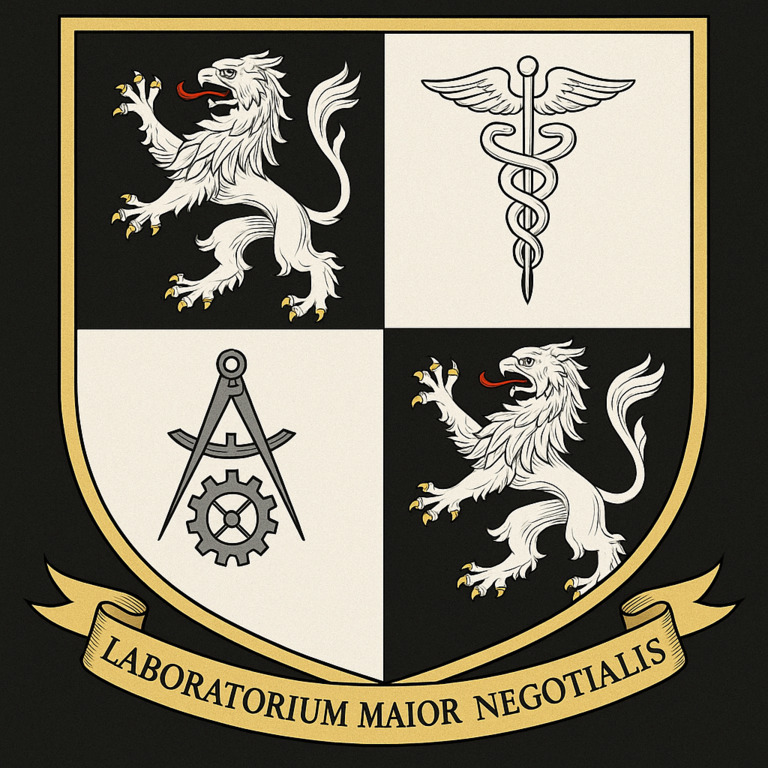

# Produceologia

> **Laboratorium Maius Productivum et Mercatorum**: Characterize productive systems, design convergence plans with the most sophisticated productive systems, and experiment with new forms of production and business at the frontier.

> Nuevas formas de hacer, mejores formas de producir.



## Linux: Build & Run

- python3 -m venv env
- source env/bin/activate
- deactivate

## Requirements

- pip freeze > requirements.txt
- pip install -r requirements.txt

## Small Scripts

```bash
find . -type f -not -path './env/**' -not -path  './.*' | shuf -n 1
```

## Build

...

## References

- [Bremontix Empreseria: A Vision for a Business Group](https://www.notion.so/Bremontix-Empreseria-A-Vision-for-a-Business-Group-17dd38c7497c80c6ae3cc59eb66fcab2?source=copy_link)