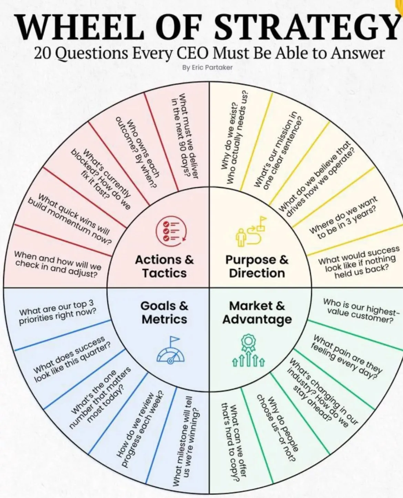

# Strategy

: 8
Related Conceptual Model: Enterprise: Corporate Strategy (Corporate%20Strategy%2017bc0f5171ec80409f75d42b8dbbac8b.md), Enterprise (Enterprise%2017ac0f5171ec81509a3ec53fc11ed75e.md)
Tags: Strategy

> Aka. **Meta dynamics**.
> 

> Aka. **Abstract Guiding Framework.**
> 

> Aka. Abstract **Governing Framework** of a System.
> 

> Aka. **Abstract Guiding Framework** Governing a System.
> 

> Aka. **Abstract Guiding Framework** that shapes the behavior of a system; generating a dynamics that **move the system** towards certain **desired state** or **set of outcomes**.
> 

> **Strategy** is a **structured yet adaptive framework** for **governing a system**, **allocating resources**, and **navigating dynamic** and uncertain environments to achieve specific goals.
> 

> A **Strategy** is a **theory for problem solving** that a system uses to navigate and adapt to an environment to achieve specific goals.
> 

> A **Strategy** serves as the **Operating System (OS)** of an organization, explaining its behavior and enabling it to make decisions in a purposeful and structured manner. It guides the organization's overall behavior and provides a framework for achieving its goals.
> 

> **Complexity theorists** define strategy as the unfolding of the internal and external aspects of the organization that results in actions in a **socio-economic** context.
> 

> A strategy can be viewed as a **meta-dynamics**, a higher-level force that governs and shapes the underlying dynamics of a system. It sets the framework within which various behaviors, decisions, and interactions unfold, directing the flow of actions and reactions to achieve long-term objectives.
> 

> [**A Strategist**] Developing a strategy requires a deep understanding of the system, its objectives, and the environment in which it operates. The process of crafting a strategy, typically undertaken by a **'strategist,'** is inherently shaped by the specific context, domain, and system involved. As a result, a **strategist** is typically effective only within **narrowly** **defined** domains, environments, and objectives.
> 

> To formulate a **strategy**, a **strategist** must deeply understand the system they aim to govern. This understanding is possible only through a **feedback loop** of doing and learning, which provides insights gained from working within the system. The strategist must also possess concrete, domain-specific knowledge of the system to create effective strategies. A contact-based follow-up with the system **shaped** by the strategy must be made to enable improvements, corrections, and learning.
> 

> A very large system is often compose of subsystem; so many strategies can be underpinign the dynamics of an organization at the same time.
>

## Index

## Characterization

> A **strategy** is the governing framework of a system, designed to achieve a set of expected outcomes. In this note, we aim to present a 'template' for how the dynamics of a system can change through a shift in the underlying governing framework (strategy).
> 

### **Context of the Strategy**

- **System**:
    - **System Characterization**: Define the system in which the strategy operates (e.g., organization, market, ecosystem, or process).
    - **Power Distribution**: Identify how decision-making authority and influence are distributed across the system (e.g., leadership, teams, external stakeholders).
    - **Divisions & Subsystems**: Breakdown of components, departments, or subunits within the system.
    - **Interactions & Relationships**: Define how parts of the system interact with each other, both internally (within the organization) and externally (with competitors, customers, partners).
    - **Agents**: Identify the key actors or stakeholders who influence or are influenced by the strategy (e.g., employees, management, customers, suppliers).
- **Risks**: Identify potential risks or uncertainties that could affect the strategy’s success. Consider both internal and external factors.
- **Resources**: List the resources needed to implement the strategy, such as financial, human, technological, and operational assets.
- **Time Frame**: Define the time horizon for the strategy (e.g., short-term, medium-term, long-term). Consider milestones and deadlines.
- **Environment**: Describe the external conditions that influence the strategy, including market trends, economic conditions, technology advancements, regulatory factors, and competitors.
- **Stakeholders**: Identify the key internal and external stakeholders whose interests are affected by the strategy. Consider their roles, needs, and expectations.
- **Feedback Loops & Interactions**: Describe the mechanisms that allow the strategy to evolve based on ongoing feedback. How will feedback from the system or stakeholders be integrated to adapt the strategy?

### **Current Dynamics and State**

- **Old Dynamics**: Describe the existing behavior or system dynamics prior to the strategy implementation. What are the challenges, strengths, weaknesses, or current trends in the system?
- **Old Behavior**: Explain how the system behaves in its current state—this could include patterns, routines, or habitual actions that drive current performance.
- **Current State**: Define the present position of the system. What is the system’s status in terms of goals, performance, and overall functionality?
- **Movement Trajectory**: Outline the system’s current path or evolution. Is it improving, stagnating, or declining? What trends or behaviors are influencing this trajectory?

### **Desired Dynamics and Desired Future State**

- **New Dynamics**: Define the new behavior or dynamics you aim to create within the system. What changes will occur in terms of performance, operations, or interactions?
- **Desired State**: Describe the end goal or state that the strategy seeks to achieve. What is the optimal outcome the strategy is driving towards (e.g., growth, market leadership, innovation, customer satisfaction)?
- **Movement Trajectory (Towards Desired State)**: Define the expected path or transformation toward the desired state. What milestones or stages will be achieved along the way?

## Taxonomy

> **Strategy** is a purposeful plan or approach designed to achieve a specific goal by carefully considering available resources, anticipating challenges, and adapting to changing circumstances.
> 

| **Category** | **Subcategory** | **Description** |
| --- | --- | --- |
| **By Scope** | **Corporate Strategy** | Focuses on the overall direction and goals of an organization. |
|  | **Business Unit Strategy** | Specific to a particular division or unit within an organization. |
|  | **Functional Strategy** | Pertains to specific functions like marketing, finance, or operations. |
|  | **Operational Strategy** | Focuses on day-to-day operations and efficiency. |
| **By Domain** | **Business Strategy** | Pertains to achieving competitive advantage in the marketplace. |
|  | **Military Strategy** | Focuses on achieving objectives in conflict or warfare. |
|  | **Political Strategy** | Aims to gain and maintain power or influence. |
|  | **Personal Strategy** | Focuses on individual goals, such as career advancement or personal development. |
| **By Time Horizon** | **Long-Term Strategy** | Focuses on goals and plans spanning several years or decades. |
|  | **Medium-Term Strategy** | Covers plans for the next 1-5 years. |
|  | **Short-Term Strategy** | Focuses on immediate actions and tactics (e.g., quarterly plans). |
| **By Approach** | **Offensive Strategy** | Focuses on gaining market share, outperforming competitors, or seizing opportunities. |
|  | **Defensive Strategy** | Aims to protect market position, resources, or competitive advantage. |
|  | **Adaptive Strategy** | Emphasizes flexibility and responsiveness to changing conditions. |
|  | **Emergent Strategy** | Develops organically over time in response to unforeseen opportunities or challenges. |
| **By Focus** | **Cost Leadership Strategy** | Aims to become the lowest-cost producer in an industry. |
|  | **Differentiation Strategy** | Focuses on offering unique products or services that command a premium price. |
|  | **Focus/Niche Strategy** | Targets a specific market segment or niche. |
| **By Complexity** | **Linear Strategy** | Follows a step-by-step, predictable plan. |
|  | **Complexity-Based Strategy** | Emphasizes adaptability, self-organization, and emergent outcomes in complex systems. |
| **By Resource Allocation** | **Growth Strategy** | Focuses on expanding market share, revenue, or geographic presence. |
|  | **Stability Strategy** | Aims to maintain current operations and market position. |
|  | **Retrenchment Strategy** | Focuses on cutting costs, downsizing, or restructuring to improve efficiency. |
| **By Innovation** | **Disruptive Strategy** | Aims to create new markets or disrupt existing ones through innovation. |
|  | **Incremental Strategy** | Focuses on continuous, small improvements to existing products or processes. |
| **By Stakeholder Focus** | **Customer-Centric Strategy** | Prioritizes customer needs and experiences in decision-making. |
|  | **Employee-Centric Strategy** | Focuses on employee well-being, engagement, and development. |
|  | **Shareholder-Centric Strategy** | Prioritizes maximizing shareholder value. |
| **By Risk Orientation** | **High-Risk Strategy** | Pursues aggressive goals with higher potential rewards and risks. |
|  | **Low-Risk Strategy** | Focuses on stability and minimizing potential downsides. |
| **By Geographic Focus** | **Global Strategy** | Aims to compete and operate in international markets. |
|  | **Local Strategy** | Focuses on specific regional or local markets. |
| **By Sustainability** | **Sustainable Strategy** | Balances economic, environmental, and social goals for long-term viability. |
|  | **Green Strategy** | Focuses specifically on environmental sustainability. |

## Strategic Management

> **Strategic planning** is the systematic process of defining an organization's long-term goals and objectives and determining the best course of action to achieve them, considering internal capabilities, external opportunities and threats, and competitive dynamics.
> 

> **Strategic management** involves the formulation, implementation, and evaluation of long-term goals and initiatives to align an organization's resources and capabilities with its external environment, ultimately achieving sustainable competitive advantage.
> 

## Strategic Management Tools

> …
> 

| **Category** | **Tool** | **Purpose** | **Key Features** |
| --- | --- | --- | --- |
| **Strategic Analysis** | **SWOT Analysis** | Identifies internal strengths, weaknesses, and external opportunities, threats. | Helps in understanding organizational position and external environment. |
|  | **PESTLE Analysis** | Analyzes political, economic, social, technological, legal, and environmental factors. | Evaluates external macro-environmental factors affecting strategy. |
|  | **Porter’s Five Forces** | Assesses industry competition and market dynamics. | Analyzes competitive rivalry, supplier power, buyer power, threat of substitutes, and new entrants. |
|  | **Value Chain Analysis** | Identifies value-creating activities and optimizes operations. | Focuses on primary and support activities for strategic improvements. |
|  | **VRIO Framework** | Evaluates resources and capabilities to determine competitive advantage. | Focuses on Value, Rarity, Imitability, and Organization. |
|  | **BCG Matrix** | Prioritizes business units or products based on market growth and market share. | Categorizes into Stars, Cash Cows, Question Marks, and Dogs. |
| **Goal Setting & Planning** | **Balanced Scorecard** | Aligns business activities with vision and strategy. | Tracks performance across financial, customer, internal processes, and learning perspectives. |
|  | **OKRs (Objectives and Key Results)** | Sets and tracks clear, measurable objectives and their outcomes. | Links goals at different organizational levels for alignment. |
|  | **Scenario Planning** | Prepares for potential future scenarios and uncertainties. | Develops alternative strategies for different scenarios. |
|  | **Strategic Roadmap** | Outlines long-term goals and the steps needed to achieve them. | Provides a visual representation of timelines and milestones. |
| **Decision-Making** | **Decision Matrix** | Evaluates options based on weighted criteria. | Provides a systematic approach to decision-making. |
|  | **Ansoff Matrix** | Guides growth strategies through market penetration, development, and diversification. | Matches products with markets for growth opportunities. |
|  | **GE-McKinsey Matrix** | Evaluates business units or products based on industry attractiveness and business strength. | Guides resource allocation and prioritization. |
| **Innovation & Growth** | **Blue Ocean Strategy** | Identifies untapped market spaces with less competition. | Focuses on value innovation and differentiation. |
|  | **Design Thinking** | Encourages creative problem-solving for innovation. | Emphasizes empathy, ideation, and prototyping. |
|  | **Growth-Share Matrix** | Focuses on growth opportunities and portfolio management. | Assesses current and potential market positioning. |
| **Risk Management** | **Risk Matrix** | Identifies and prioritizes risks based on impact and likelihood. | Supports strategic risk mitigation. |
|  | **Monte Carlo Simulation** | Predicts potential outcomes using probability models. | Assists in strategic decision-making under uncertainty. |
| **Performance Measurement** | **KPIs (Key Performance Indicators)** | Tracks performance aligned with strategic goals. | Ensures accountability and progress tracking. |
|  | **EFQM Model** | Improves organizational excellence through self-assessment. | Focuses on leadership, strategy, and people results. |
| **Change Management** | **Kotter’s 8-Step Model** | Guides successful implementation of change initiatives. | Emphasizes urgency, vision creation, and empowerment. |
|  | **ADKAR Model** | Focuses on individual transitions during organizational change. | Aligns Awareness, Desire, Knowledge, Ability, and Reinforcement. |

## References

- …
- [Strategist](https://en.wikipedia.org/wiki/Strategist)
- [Igor Ansoff](https://en.wikipedia.org/wiki/Igor_Ansoff)
- [Strategic planning](https://en.wikipedia.org/wiki/Strategic_planning)
- https://en.wikipedia.org/wiki/Strategy
- [Strategic Management](https://en.wikipedia.org/wiki/Strategic_management)
- https://en.wikipedia.org/wiki/Metadynamics
- ‣