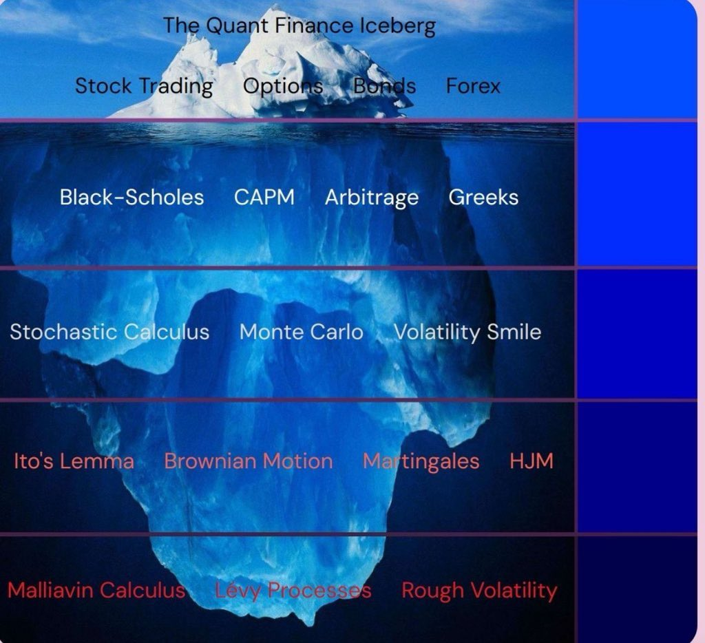

# Quantitative Investment (QI)

Workflow:

-

## Problem Domain

> Defines **what** is being modeled or analyzed.

| Category               | Examples                                       |
| ---------------------- | ---------------------------------------------- |
| Asset Pricing          | Equities, Fixed Income, Derivatives            |
| Risk Management        | Credit Risk, Market Risk, Liquidity Risk       |
| Portfolio Construction | Optimization, Diversification, Allocation      |
| Trading Strategies     | Market Making, Statistical Arbitrage, Momentum |
| Corporate Finance      | Valuation, Capital Structure, Cost of Capital  |
| Macroeconomic Analysis | FX, Interest Rates, Commodities                |

## Financial Data

Involves sourcing, cleaning, storing, and preprocessing **financial data**.

| Subsystem            | Examples                                                    |
| -------------------- | ----------------------------------------------------------- |
| **Market Data**      | Price ticks, order books, historical OHLCV                  |
| **Fundamentals**     | Balance sheets, earnings, macroeconomic indicators          |
| **Alternative Data** | Satellite, sentiment, ESG, geolocation                      |
| **Data Engineering** | Pipelines, feature stores, real-time ingestion              |
| **Preprocessing**    | Normalization, missing value imputation, feature extraction |

## Quantitative Strategy

> ...

| **Strategy Type**          | **Methodology**                           | **Primary Data**            | **Model/Algorithm Examples**                      | **Notes / Risks**                                    |
| -------------------------- | ----------------------------------------- | --------------------------- | ------------------------------------------------- | ---------------------------------------------------- |
| **Statistical Arbitrage**  | Mean reversion between correlated assets  | Price, returns, volume      | Pairs trading, cointegration tests, Kalman filter | Relies on stable statistical relationships           |
| **Momentum / Trend**       | Buy winners, sell losers                  | Time-series prices          | Moving averages, breakout models, regression      | Suffers in sideways markets                          |
| **Mean Reversion**         | Exploit short-term price mispricings      | Price, intraday ticks       | Bollinger Bands, Ornstein–Uhlenbeck processes     | Requires strong reversion signal and tight execution |
| **High-Frequency Trading** | Microstructure-based statistical edges    | Tick data, order book       | Market making, latency arbitrage                  | Requires ultra-low latency; high tech cost           |
| **Machine Learning-Based** | Predictive modeling from features         | Prices, news, alt data      | Random Forests, XGBoost, LSTM, RL                 | High overfitting risk; interpretability challenges   |
| **Event-Driven**           | React to news, earnings, macro events     | News feeds, filings, EPS    | NLP models, earnings drift models                 | Hard to model rare events                            |
| **Market Microstructure**  | Exploit order flow and execution patterns | Order book, trade prints    | Queue models, imbalance metrics                   | Short horizon; high execution complexity             |
| **Index Arbitrage**        | ETF vs index/futures pricing gaps         | Real-time NAVs, quotes      | Basket replication, futures pricing               | Needs precise and fast pricing                       |
| **Cross-Asset Arbitrage**  | Exploit mispricing across assets          | FX, equities, rates         | Cross-hedging, regression/correlation             | Depends on market linkage strength                   |
| **Volatility Arbitrage**   | Implied vs. realized volatility           | Option chain, realized vols | GARCH, stochastic volatility, Monte Carlo         | Vega/gamma exposure; hedging necessary               |
| **Quant Macro**            | Use macroeconomic indicators systemically | GDP, CPI, interest rates    | Dynamic factor models, PCA, VAR                   | Lagging signals; regime dependence                   |
| **Sentiment-Based**        | Social/media opinion analysis             | Social media, news, forums  | NLP models, sentiment indexes                     | Noisy and manipulable data                           |
| **Liquidity Provision**    | Passive spread capture via quoting        | Tick data, volume           | Inventory control, optimal spread models          | Adverse selection and inventory risk                 |
| **Options Strategies**     | Complex trades on volatility & Greeks     | Option prices and Greeks    | Delta-neutral, straddles, gamma scalping          | Multidimensional risk exposure                       |
| **Calendar/Seasonal**      | Use recurring temporal market patterns    | Historical prices           | Fourier series, date-based regression             | Weak alpha; often crowded                            |
| **Fractal/Chaos Models**   | Use nonlinear and self-similar patterns   | Price time series           | Hurst exponent, Mandelbrot fractals               | Not widely accepted in practice                      |
| **Reinforcement Learning** | Learn trading policies through simulation | Environment feedback loop   | DQN, PPO, Actor-Critic                            | Unstable learning; poor generalization               |
| **Execution Algorithms**   | Minimize market impact/slippage           | Market depth, volume        | VWAP, TWAP, POV, IS                               | Not alpha-generating; used for cost control          |
| **Information Arbitrage**  | Exploit early or private info access      | Proprietary feeds, alt data | Text mining, data scraping pipelines              | Regulatory/legal gray area                           |

## Quantitative Modelling

| **Modeling Domain**       | **Techniques / Examples**                                                                                                | **Typical Applications**                 |
| ------------------------- | ------------------------------------------------------------------------------------------------------------------------ | ---------------------------------------- |
| **Time Series Analysis**  | - ARIMA, SARIMA - GARCH, EGARCH - Cointegration & stationarity tests                                               | Forecasting returns, volatility modeling |
| **Factor Models**         | - CAPM, Fama-French 3/5-factor models - Principal Component Analysis (PCA)                                            | Asset pricing, portfolio construction    |
| **Machine Learning & AI** | - Supervised: linear/logistic regression, SVM, trees - Unsupervised: clustering, PCA - Reinforcement Learning (RL) | Alpha generation, strategy optimization  |
| **Stochastic Calculus**   | - Black-Scholes, Ito calculus - Monte Carlo simulation - Binomial/trinomial trees                                  | Derivative pricing, volatility modeling  |

## Portfolio Optimization

- Mean-variance optimization (Markowitz model).
- Risk parity, Black-Litterman model.

## Risk Management & Metrics

Risk Metrics:

- Value at Risk (VaR), Conditional VaR (CVaR).
- Maximum drawdown, Sharpe ratio, Sortino ratio.

Stress Testing & Scenario Analysis:

- Historical simulations, hypothetical scenarios.

### Computational Method

Executes models and strategies using computing resources.

| Component         | Examples                                               |
| --------------------- | ------------------------------------------------------ |
| **Numerical Methods** | Monte Carlo, Finite Differences, Optimization Solvers  |
| **Backtesting**       | Event-driven simulation engines, walk-forward analysis |
| **Execution Systems** | Smart order routing, slippage control                  |
| **Infrastructure**    | HPC clusters, cloud, GPU, low-latency systems          |

## Execution & Trading Strategies

Algorithmic Trading:

- High-frequency trading (HFT), statistical arbitrage.
- Market-making strategies.

Backtesting:

- Walk-forward analysis, survivorship bias checks.

## Performance Evaluation

> Assesses results and provides adaptive feedback for strategy improvement.

| Metric Category | Examples                                             |
| --------------- | ---------------------------------------------------- |
| **Performance** | Sharpe Ratio, Alpha, IR, CAGR                        |
| **Risk**        | VaR, Drawdown, Beta, CVaR                            |
| **Robustness**  | Sensitivity, stress testing, overfitting diagnostics |
| **Compliance**  | Regulatory limits, ESG alignment, auditability       |

## Decision & Execution

Implements strategies and makes real-time decisions.

| Subsystem             | Examples                              |
| --------------------- | ------------------------------------- |
| **Signal Processing** | Trade entry/exit, hedge triggers      |
| **Order Management**  | VWAP, TWAP, iceberg orders            |
| **Risk Controls**     | Kill switches, position limits        |
| **Trade Execution**   | Algorithmic trading, DMA, broker APIs |

## Governance & Strategic Integration

Links quant systems to business strategy and external constraints.

| Area                     | Examples                                              |
| ------------------------ | ----------------------------------------------------- |
| **Regulatory**           | Basel III, MiFID II, Dodd-Frank                       |
| **Strategic Fit**        | Alignment with investment goals, capital requirements |
| **Reporting & Auditing** | Model audit trails, compliance logs                   |
| **Human Oversight**      | Analyst review, explainability, override systems      |

## Key Challenges

- Overfitting (in ML models).
- Non-stationarity of financial data.
- Regulatory and ethical considerations.

## References

- [Quantitative Analysis (QA)](https://en.wikipedia.org/wiki/Quantitative_analysis_(finance))
- [Algorithmic Trading](https://en.wikipedia.org/wiki/Algorithmic_trading)
- https://sungwookle.github.io/research/2105121010/img/AI+for+Trading+Learning+Nanodegree+Program+Syllabus.pdf
- https://learn-udacity.top/1/AI-for-Trading-T/index.html
- https://github.com/jseluis/artificial_intelligence_for_trading
- https://github.com/wilsonfreitas/awesome-quant
- https://github.com/cantaro86/Financial-Models-Numerical-Methods
- https://python.quantecon.org/intro.html
- https://julia.quantecon.org/intro.html
- https://github.com/nkaz001/hftbacktest
- https://github.com/letianzj/QuantResearch/tree/master
- https://github.com/tradytics/eiten
- https://github.com/je-suis-tm/quant-trading
- https://www.quantconnect.com/
- https://numer.ai/
- https://quantocracy.com/
- https://www.janestreet.com/puzzles/
- https://github.com/stefan-jansen/machine-learning-for-trading/tree/main/01_machine_learning_for_trading
